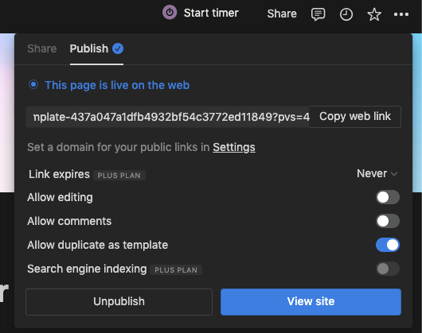

# Free Notion to Web publisher

> The perfect starter kit for building websites with Next.js and Notion.

## Intro

I personally use this method to convert notion pages into websites

## Features

- Setup only takes a few minutes
- Excellent page speeds
- Can be deployed for free on any hosting provider
- Can be configured with custom domain

## Demos

- [Default demo](https://blog.toffeemoney.com) - Deployed from the `main` branch

## Setup for local development

**All config is defined in [site.config.ts](./site.config.ts).**

Its is important to use node 16.16.0 with npm 8.11.0

1. Fork / clone this repo
2. Change a few values in [site.config.ts](./site.config.ts)

I tried to make configuration as easy as possible — All you really need to do to get started is edit `rootNotionPageId` in [site.config.ts](./site.config.ts).**

We recommend duplicating the [default page](https://silicon-woodpecker-5c5.notion.site/Next-js-Notion-Starter-Kit-Template-437a047a1dfb4932bf54c3772ed11849?pvs=4) as a starting point, but you can use any public notion page you want.

Make sure your root Notion page is **public** and your notion page that you want to publish as website has a public published page

4. Copy the link to your clipboard. Extract the last part of the URL that looks like `437a047a1dfb4932bf54c3772ed11849`,continous string of 32 charachets, after `-` and before `?` which is your page's Notion ID. [as seen in the above image].
Put that value in `rootNotionPageId` in [site.config.ts](./site.config.ts).**

5. `npm install --legacy-peer-deps`
6. `npm run dev` to test locally
